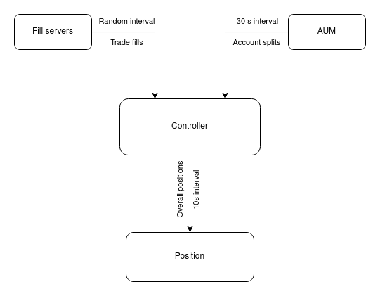

# ASSUMPTIONS
1. Stock values fluctuate in the range [`-PRICE_FLUCTUATION_PERCENTAGE_LIMIT`, `PRICE_FLUCTUATION_PERCENTAGE_LIMIT`] percent.
2. Trade fills are sent at random intervals. The maximum time is specified by the variable `TIME_INTERVAL_LIMIT`.
3. Stock price cannot be less than 1$.
4. AUM and Controller servers start with 2 accounts. Account number limit is set by a variable `ACCOUNT_NUMBER_LIMIT`.
5. Percentage of new account creation is set by a variable `ACCOUNT_CREATION_PERCENTAGE`.

The AUM server tries to give at least 1% of the split to the accounts. If the limit is greater than 50, some accounts may have 0% split.



# NOTES

`divide_split` function in `aum.py` may be a little overcomplicated due to an attempt to make the distribution of splits between users more random.

First 2 accounts are hardcoded with 50% split.

For simplicity reasons, position server is asking controller server for the data. In the task description, the controller server had to report positions to position server.

Stocks divition is implemented with brute force solution. There is plenty of room for optimization.

Fill and AUM servers are printing their post requests. It can be turned off by removing `ENV PYTHONUNBUFFERED 1` line from Dockerfile.

Overall positions are printed to docker compose logs by position server every 10s.

After running this service you can easly view and test all endpoints with this url: http://localhost:8000/docs
  
# DOCKER
To build and run service on your local machine you need to:

1. You need to have docker already installed.

2. Run command to build docker image:
```
docker-compose up --build
```

3. To kill running containers press ctrl + c.


